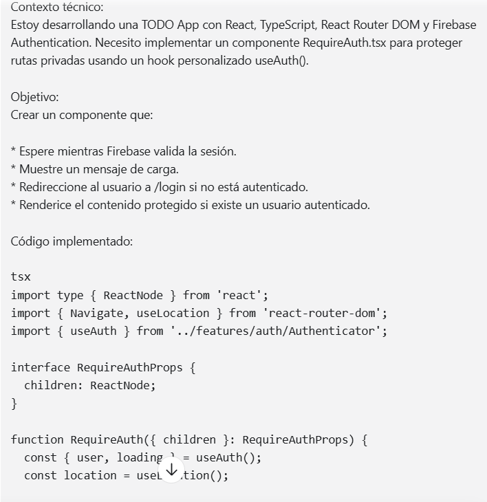
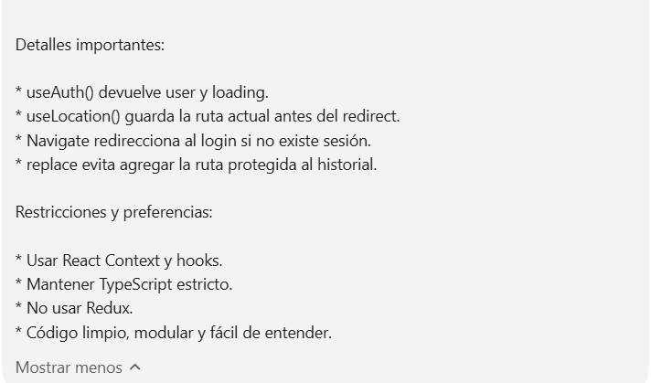
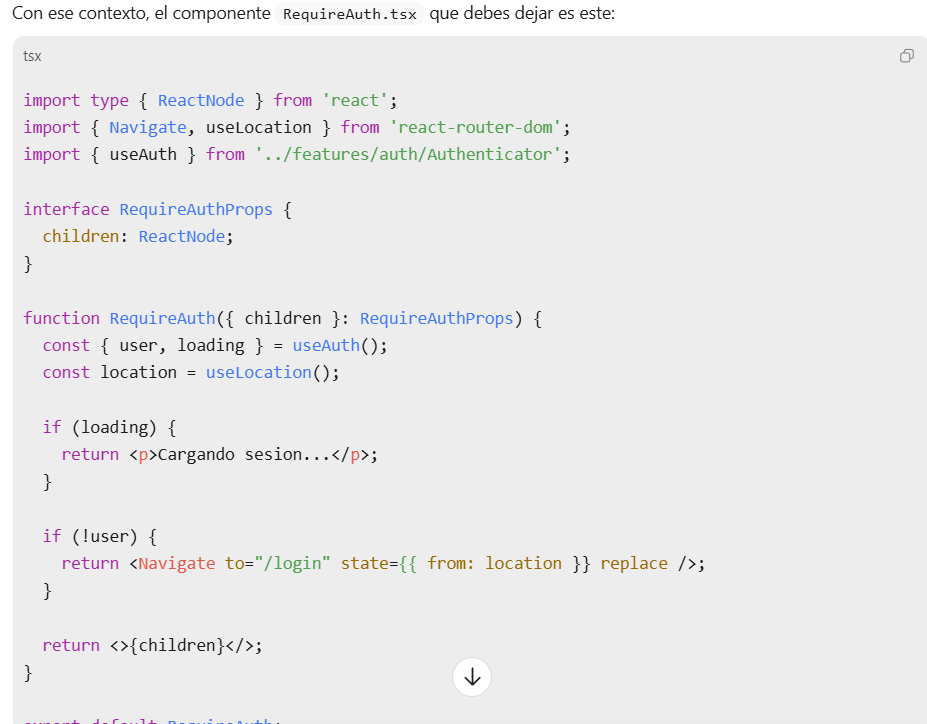
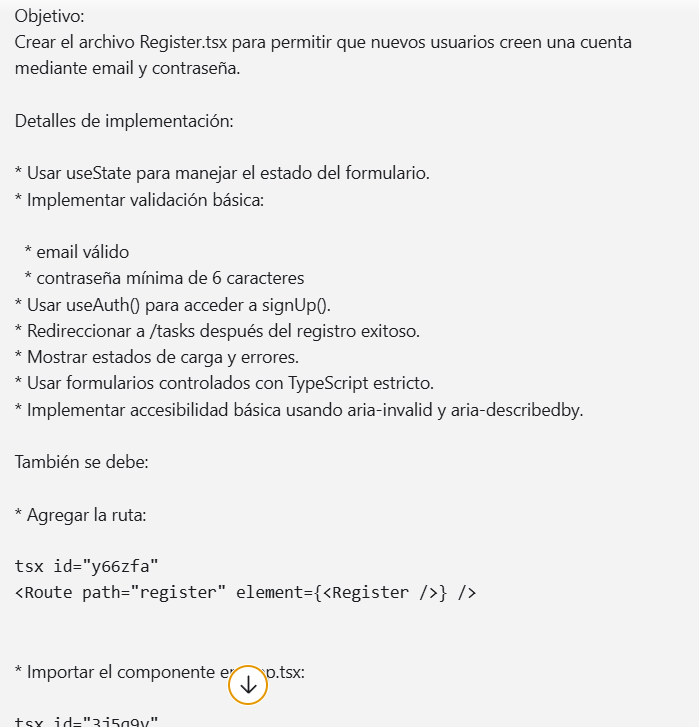
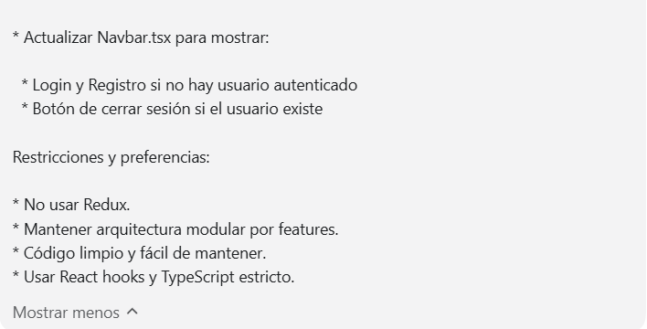
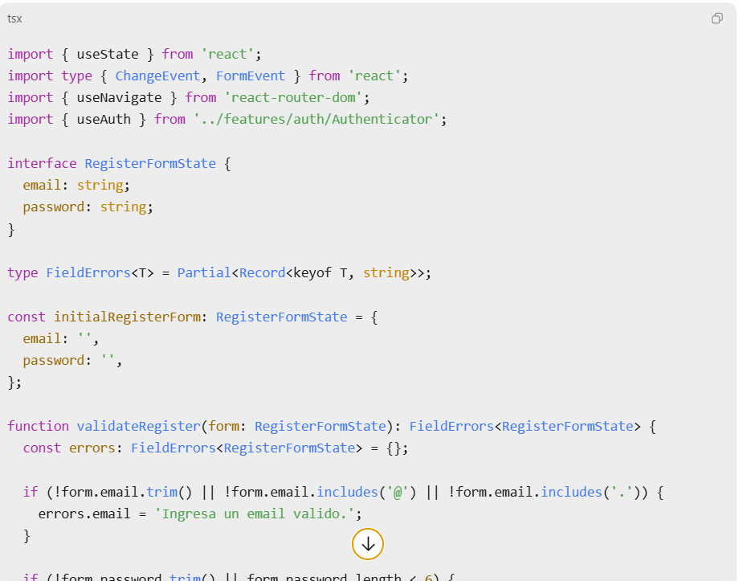
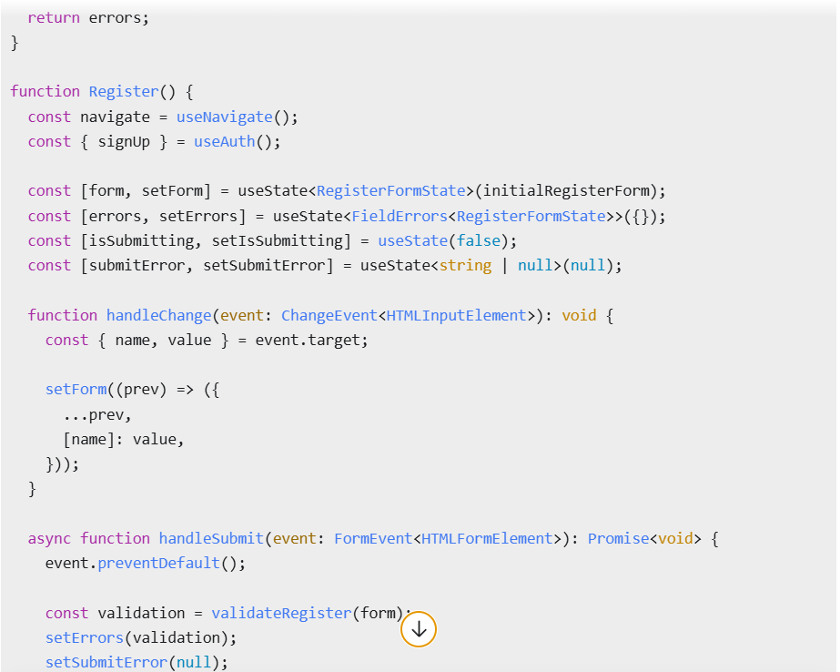
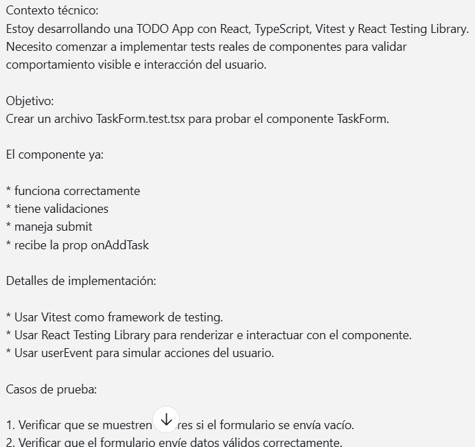
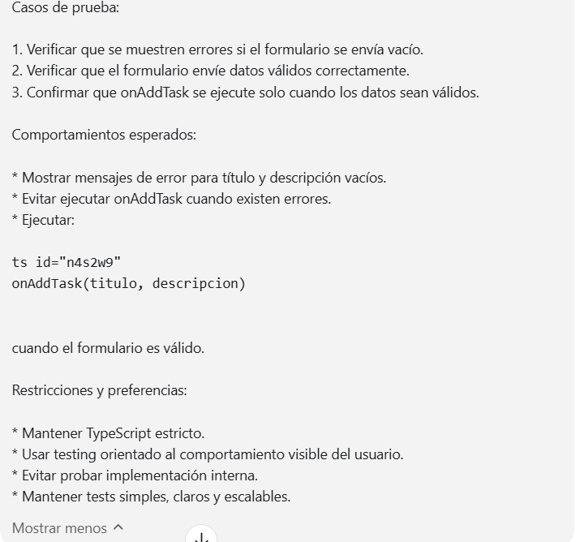
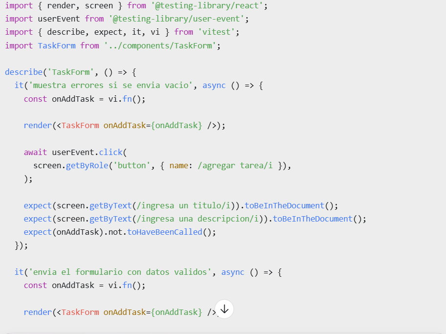

# TaskAura

TaskAura es una aplicación web para gestionar tareas por usuario autenticado. Permite registrarse, iniciar sesión, crear tareas con título, descripción y fecha límite, marcarlas como completadas, editarlas, eliminarlas y enviar un resumen por email.

## URL de producción

[Ver aplicacion en produccion](https://m4-luna-gomez.vercel.app/#/)

Nota:
La aplicación usa `HashRouter` para que las rutas funcionen correctamente en Vercel incluso al refrescar la página.

---

## Funcionalidades

### Autenticación
- Registro con email y contraseña
- Login con email y contraseña
- Login con Google
- Logout
- Protección de rutas privadas
- Manejo visible de errores

### Gestión de tareas
- Crear tareas
- Listar tareas del usuario autenticado
- Editar tareas
- Eliminar tareas
- Marcar tareas como completadas o pendientes
- Asignar fecha límite
- Persistencia en Firestore
- Cada usuario solo puede ver sus propias tareas

### Email
- Envío de resumen de tareas mediante botón
- Integración con AWS SES
- Uso de Vercel Functions para no exponer secretos en el frontend

### Testing
- Test de componente para `TaskForm`
- Test de componente para `EmailSummaryButton`
- Test unitario para la generación del resumen

### Deploy
- Deploy en Vercel
- Variables de entorno configuradas
- URL pública funcional

---

## Tecnologías usadas

- React
- TypeScript
- Vite
- React Router DOM
- Firebase Authentication
- Cloud Firestore
- AWS SES
- Vercel Functions
- Vitest
- React Testing Library

---

## Decisiones arquitectónicas

### Autenticación
La autenticación se centralizó usando `Context` mediante `Authenticator` y `useAuth()`. Esto permite acceder al estado del usuario y a las acciones de login, registro y logout desde cualquier parte de la app.

### Rutas protegidas
Las rutas privadas usan `RequireAuth`, que impide acceder a tareas sin haber iniciado sesión.

### Persistencia
Las tareas se almacenan en Cloud Firestore y cada documento incluye `userId`. Esto permite filtrar por usuario y aplicar seguridad real desde Firestore.

### Seguridad
Las reglas de Firestore validan que cada usuario solo pueda leer y modificar sus propias tareas.

### Emails
El envío de emails se hace desde `/api/send-email` con una Vercel Function. De esta forma, las credenciales de AWS nunca quedan expuestas en el frontend.

---

## Instalacion local

### 1. Clonar el repositorio

```bash
git clone https://github.com/luuunita/M4_LunaGomez.git
cd M4_LunaGomez

```

### 2. Instalar dependencias

```bash
npm install
```

### 3. Crear archivo .env
Crear un archivo .env en la raiz del proyecto usando como referencia .env.example

### 4. Ejecutar frontend 

```bash

npm run dev
```

### 5. Ejecutar frontend + functions
Para probar tambien el envio de emails
```bash

npx vercel dev
```
## Variables de entorno
### Firebase

```bash
 VITE_FIREBASE_API_KEY=
VITE_FIREBASE_AUTH_DOMAIN=
VITE_FIREBASE_PROJECT_ID=
VITE_FIREBASE_APP_ID=
```

AWS SES

```bash 
AWS_REGION=
AWS_ACCESS_KEY_ID=
AWS_SECRET_ACCESS_KEY=
SES_FROM_EMAIL=
```

## Flujo de envio de emails

- El usuario hace clic en Enviar mi resumen
- El frontend construye un resumen con tareas pendientes, completadas y próximas fechas
- Se hace un POST a /api/send-email
- La Vercel Function usa AWS SES para enviar el correo
- El frontend muestra éxito o error
Importante:
AWS SES está en modo sandbox, así que el envío puede estar limitado a identidades verificadas.

## Seguridad de credenciales

- .env está incluido en .gitignore
- .env.example no contiene valores sensibles
- Firebase usa variables de entorno
- AWS SES usa variables de entorno privadas
- No se exponen secretos en el frontend

## Uso de IA en el proceso

### Primer Prompt




### Segundo Prompt





### Tercer Prompt




se utilizó como apoyo técnico durante el desarrollo para:

- transformar requisitos funcionales algunos pasos
- resolver integración con Firebase, Firestore, Vercel y AWS SES
- estructurar testing
- mejorar coherencia entre componentes, servicios y tipos
- apoyar el diseño visual
- redactar la documentación final

## Limiraciones conocidas

- AWS SES esta en sandbox, así que el envío puede estar limitado a identidades verificadas.
- La app usa HashRouter para compatibilidad de rutas en Vercel.

## Autora 
Luna Gomez, Desarrolladora Fullstack junior.


